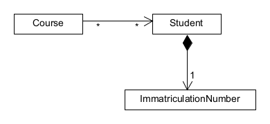

# Aufgabe 3: Zykelfreiheit mit Hilfe des Dependency Inversion Principles (50 Punkte)

Der Code in dieser Aufgabenstellung enthält zwei Zykel. 
- Einer davon ist ziemlich offensichtlich unnötig und lässt sich leicht entfernen.
- Der andere ist in der in der Fachlichkeit angesiedelt.

Im zweiten Fall müssen Sie das Dependency Inversion Principle anwenden, um die Zykel zu
entfernen.

Der Code implementiert ein einfaches Campus-Management-System. Studierende (`Student`)
können sich für Kurse (`Course`) anmelden. Für jeden Kurs kann die durchschnittliche 
Semesteranzahl der Teilnehmenden berechnet werden. Für die Studierenden wiederum
wird ECTS-Last berechnet.

Es gibt als Hilfestellung zwei Tests unter `thkoeln.archilab.st2.a3`: 
- `StudentTest` testet die beschriebene Business-Logik (oberflächlich). Dieser Test ist
  jetzt grün. Sie können ihn nutzen, um sicherzustellen, dass die Business-Logik beim 
  Refactoring korrekt bleibt.
- `CycleTest` testet auf Zykelfreiheit. Dieser Test ist jetzt nicht grün; durch Ihr
  Refactoring sollte er grün werden. 

## Aufgabenstellung 

1. Schauen Sie sich die Klassen in `thkoeln.archilab.st2.a3` und identifizieren Sie die 
   Gründe für die Zykel.
2. Welcher der beiden Zykel ist unnötig? Entfernen Sie den zuerst.
3. Dann überlegen Sie sich für den anderen Zykel, welche Abhängigkeits-Richtung gewünscht ist
   (Tipp: Schauen Sie auf das Domänenmodell, also das fachliche Datenmodell)
4. Refactorn Sie den Code, so dass er keine Zykel mehr enthält, indem Sie ein passendes Interface 
   einführen (und was sonst noch nötig ist).
   - Das gegebene Domain-Model darf dabei nicht verändert werden (sprich: die 
     gewünschten Abhängigkeits-Richtungen liegen fest)
5. Die Tests sind nur Hilfestellung, bewertet wird der Code. 
6. Sie können auch für unvollständige oder sogar nicht compilierende Lösungen Punkte 
   erhalten. Versuchen Sie also, so weit wie möglich zu kommen. Die volle Punktzahl 
   gibt es aber nur für eine vollständige, compilierende Lösung, bei der beide Tests 
   grün sind.

