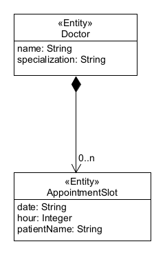

# Aufgabe 5: REST-Spezifikation (15 Punkte)

In dieser Aufgabe sollen Sie ein **REST-API** spezifizieren. 

## Kurze Beschreibung der Software
*(Sie müssen das nicht analysieren. Der Text ist nur dazu da, damit Sie den Code und die Aufgabenstellung besser verstehen.
Der Code hierzu ist für diese Aufgabe noch nicht nötig, hilft aber vielleicht beim Verständnis. Den Code finden Sie in
Aufgabe 6.)*

Several doctors are working in a hospital. Each doctor has a number of slots for appointments.
The software system for which we specify a REST API is responsible for managing the free slots of a 
doctor. For simplicity reasons, each slot is exactly 1h long, and is defined by its starting time. 
I.e. the slot from 10:00 - 11:00 has the number 10. Booking a slot is simply done by entering 
a patient's name in the appointment slot. 
    

### Glossar (als Hilfe für den obigen Text)

| Englisch      | Deutsch               |
|---------------|-----------------------|
| hospital      | Krankenhaus           |
| slot          | Zeitschlitz           |
| appointment   | (Arzt-)Termin         |
| to book       | (einen Termin) buchen |

## Unteraufgabe 2a: Spezifikation des REST-APIs

Das  API muss die folgenden Operationen unterstützen: 
1. Daten eines `Doctors` abfragen (ohne Ausgabe der `AppointmentSlots`)
2. Spezialisierung (`specialization`) eines `Doctor` ändern
3. `Doctor` neu anlegen
4. `AppointmentSlot` für einen `Doctor` hinzufügen
5. Einen bestimmten `AppointmentSlot` eines `Doctors` für einen Patienten buchen (dessen Name wird
   dann in `patientName` gespeichert)
6. Alle freien `AppointmentSlots` für einen `Doctor` abfragen (Hinweis: `patientName` ist niemals `null`, 
   sodern hat den Wert `undefined`, wenn der Slot noch frei ist)
7. Alle (sowohl freie wie gebuchte) `AppointmentSlots` für einen `Doctor` stornieren und aus dem System 
   herausnehmen

[Die Datei exercise2-REST.yaml](./exercise2-REST.yaml) ist ein leeres Template für Spezifikation 
des REST-APIs. Spezifizieren Sie in dieser Datei jeweils URI, HTTP Verb, sowie Return Codes für 
alle obigen Zugriffsoperationen.

__Hinweise__: 
* Der Einfachheit halber ist in dieser Aufgabe ein Datum als String dargestellt.
* Die API-Endpoints (1) und (2) sind schon ausgefüllt, damit Sie ein Beispiel haben, wie das aussieht.
* Bitte nutzen Sie bei Spezifikation und Implementation das lowerCamelCase-Format (also so: `/awesomeStuff/...`)
* Beachten Sie, dass es bei `ReturnCodeFailure` mehrere Fehlerursachen und damit auch mehrere Return Codes
  geben kann.
* Als Return Codes kommen in dieser Aufgabe nur 200 (OK), 201 (Created), 404 (Not Found), 409 (Conflict) 
  und 422 (Unprocessable Entity) vor. Nicht alle Return Codes kommen in jeder Operation vor.

